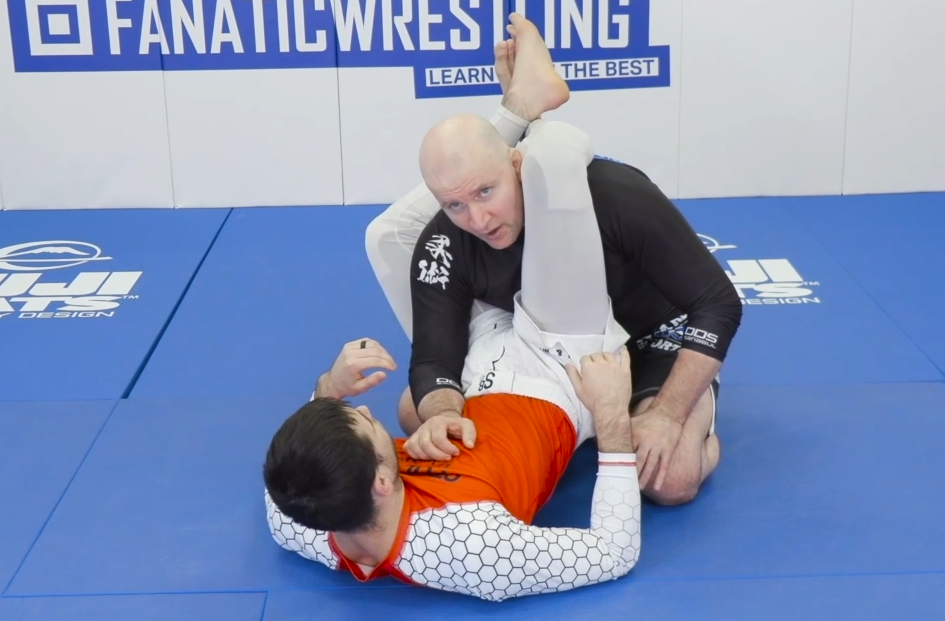

# Trap Triangle Defenses
New Wave Submission Escapes Vol. 4
# General Considerations of the [[Triangle]]
- More you understand the triangle, easier it is to escape
- Most people first are in a trap triangle:  then move into an actual figure four triangle
- Easier to escape the trap triangle rather than a figure four
	- Begin escaping at trap triangle

## Escaping the Trap Triangle Method 1

1. Posture up, bring exposed arm to opponents waistline
2. Once Posture, do a reach back. (Prevents opponent knee from coming over you shoulder and putting pressure on carotid
	1. Elbow goes behind opponent's knee (thumb under?)

## Escaping the Trap Triangle Method 2 8:20

1. Posture up, bring exposed arm to opponents waistline
2. Bring exposed arm to opponent's side and from in their armpit
	- Your elbow touches your knee and their hip
	- Your arm creates a frame between your opponent's armpit and their hip.
	- This prevents their attacking leg from coming over your shoulder and putting pressure on carotid
  
